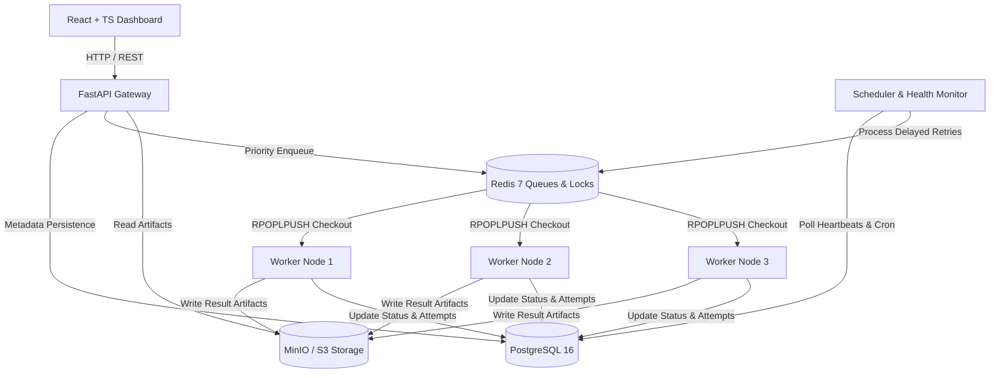

# TaskFlow — Distributed Job Processing & ML Task Scheduler

[](https://github.com/charan300804/Task-Flow/actions)
[](https://www.python.org/)
[](https://reactjs.org/)
[](https://opensource.org/licenses/MIT)

TaskFlow is a production-grade, fault-tolerant distributed job processing platform and machine learning task scheduler built with **FastAPI**, **Redis**, **PostgreSQL**, **MinIO (S3)**, and **React + TypeScript**.

It allows users and microservices to submit computational workloads asynchronously via a high-performance REST API. Jobs are enqueued into a **multi-queue Redis architecture**, checked out by **stateless background worker daemons** using **priority scheduling** and **distributed locks**, processed concurrently, monitored via **worker heartbeats**, automatically retried with **exponential backoff**, and persisted in **PostgreSQL** and **MinIO Object Storage**.

The platform features a **React + TypeScript + Tailwind CSS monitoring dashboard** with real-time analytics, queue depth meters, dead-letter queue management, and cron schedule orchestration.

---

## 🌟 Key Engineering Features

- **Custom Worker Orchestration**: Built directly on Redis primitives (`RPOPLPUSH`, `SET ... NX PX` distributed locks, Lua scripts) without framework abstractions hiding internal distributed mechanics.
- **Real ML Prediction Workloads**: Machine learning prediction engine (RandomForest House Price Model) computing batch predictions, feature importances, statistical metrics, and uploading output artifacts to MinIO object storage.
- **Priority Queue Scheduling & Starvation Avoidance**: Multi-tiered Redis queues (`critical`, `high`, `default`, `low`, `ml`) processed in priority order with capability matching.
- **Fault Tolerance & Worker Recovery**: Automated heartbeat monitor (5s interval). Automatically detects node crashes (>15s timeout), sets state to `UNHEALTHY`, and requeues orphan jobs.
- **Configurable Exponential Backoff Retries**: Automatic delay calculation:
  $$\text{delay} = \text{base\_delay} \times 2^{(\text{attempt} - 1)}$$
- **Dead-Letter Queue (DLQ)**: Quarantines jobs exceeding max retry limits with administrative inspection, re-enqueue, and purge APIs.
- **Idempotency Guarantees**: Client-provided `Idempotency-Key` prevents duplicate task creation and duplicate execution side-effects.
- **Cron Schedule Engine**: Evaluates recurring cron expressions (`0 */6 * * *`) and dispatches due jobs automatically.
- **Real-Time Monitoring Dashboard**: React + TypeScript + Recharts dashboard displaying active throughput, status distribution, worker node health, and DLQ controls.

---

## 📐 System Architecture



---

## 🛠️ Technology Stack

| Layer | Technology |
|---|---|
| **Backend API** | Python 3.12+, FastAPI, Pydantic, SQLAlchemy 2.0 (AsyncPG), Uvicorn |
| **Database** | PostgreSQL 16 (Users, Jobs, JobAttempts, Workers, Schedules, AuditLogs) |
| **Queues & Cache** | Redis 7 (Priority Queues, Distributed Locks, Worker Heartbeats, Delayed Sets) |
| **Object Storage** | MinIO / AWS S3 (ML Prediction Result Artifacts, Large Payloads) |
| **ML Engine** | Scikit-Learn (RandomForestRegressor), Pandas, NumPy |
| **Frontend** | React 18, TypeScript, Vite, Tailwind CSS, Recharts, Lucide Icons |
| **Infrastructure** | Docker, Docker Compose, Nginx, Prometheus, Grafana |
| **Testing** | Pytest, Pytest-Asyncio, Locust Load Tester, GitHub Actions CI |

---

## 🚀 Quick Start (Docker Compose)

The entire TaskFlow platform (API, Postgres, Redis, MinIO, 3 Worker Nodes, Scheduler, Frontend, Prometheus) can be launched with a single command:

```bash
# 1. Clone the repository
git clone https://github.com/your-username/taskflow.git
cd taskflow

# 2. Launch multi-worker cluster with Docker Compose
docker compose up --build -d

# 3. Check running containers
docker compose ps
```

### Access Services
- **Dashboard UI**: [http://localhost:3000](http://localhost:3000)
- **FastAPI OpenAPI Docs**: [http://localhost:8000/docs](http://localhost:8000/docs)
- **MinIO Object Console**: [http://localhost:9001](http://localhost:9001) (`minioadmin` / `minioadmin`)
- **Prometheus Metrics**: [http://localhost:9090](http://localhost:9090)

### Seed Users
- **Admin**: `admin@taskflow.io` / `admin123`
- **User**: `user@taskflow.io` / `user123`

---

## 💻 Local Development Setup (Manual)

### Backend
```bash
cd backend
python -m venv venv
source venv/bin/activate  # On Windows: venv\Scripts\activate
pip install -r requirements.txt

# Start API Server
uvicorn app.main:app --reload --port 8000

# Start Worker Daemon (Terminal 2)
python -m app.workers.daemon worker-dev-1

# Start Scheduler Monitor (Terminal 3)
python -m app.scheduler.monitor
```

### Frontend
```bash
cd frontend
npm install
npm run dev
```

---

## 🧪 Testing Suite

### Run Pytest Unit & Integration Tests
```bash
cd backend
pytest -v
```

### Run Failure Recovery Scenarios
```bash
# Test Worker Crash Recovery
python scripts/test_worker_crash.py

# Test Idempotency Key Submission
python scripts/test_idempotency.py
```

### Execute Locust Load Testing
```bash
cd load-tests
locust -f locustfile.py --host=http://localhost:8000
```
Open [http://localhost:8089](http://localhost:8089) to run concurrent load simulation up to 500 users.

---

## 📊 Database Schema & Index Rationale

TaskFlow utilizes PostgreSQL 16 with optimized indexes:
- `jobs.status`: Speeds up status filtering for dashboard and DLQ.
- `jobs.priority`: Speeds up priority ordering.
- `jobs.idempotency_key`: $O(1)$ duplicate submission lookup.
- `jobs.scheduled_at`: Fast query for due cron tasks.
- `workers.last_heartbeat`: Efficient detection of stale worker nodes.

---

## 📝 Resume Positioning & Interview Highlights

When featuring TaskFlow on your software engineering resume:

> **Distributed Systems & ML Task Scheduler — Python, Redis, PostgreSQL, FastAPI, Docker**
> - Designed a distributed asynchronous job processing platform supporting ML prediction workloads, priority queuing, and object storage artifact persistence.
> - Implemented fault-tolerant worker orchestration with Redis `RPOPLPUSH`, distributed locking, 5-second heartbeats, and automated crash recovery.
> - Engineered exponential backoff retries and Dead-Letter Queue handling for zero-data-loss execution reliability.
> - Built a React + TypeScript monitoring dashboard providing real-time job throughput analytics and worker cluster health status.
